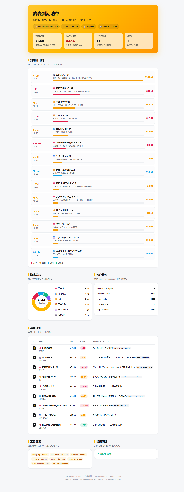

<div align="center">

# 🍔⏳ 麦麦到期清单 · mcd-expiry-ledger

**你的每一张券、每一分积分、每一次抽奖机会，都在倒计时。**

*Every McDonald's China coupon, point balance and lottery draw is quietly counting down. Nobody ever put those clocks on one page — so we did.*

[](https://www.python.org/)
[](#-30-秒上手)
[](https://open.mcd.cn/mcp)
[](https://github.com/M-China/mcd-developer-innovation-challenge)

**[📖 交互式样例报告](examples/report-sample.html)** · **[🎮 无 Token 立即体验](#-30-秒上手)** · **[🔌 MCP 工具覆盖](#-mcp-工具覆盖)**

</div>

---

## 为什么是这个项目

打开你的麦当劳 App 看一眼：

| 你拥有的 | 什么时候消失 |
|---|---|
| 一堆「麦麦省」没领的券 | 券有有效期 |
| 账户里的积分 | **按周期清零** |
| 免费抽奖次数 | **按周期重置，过期作废** |
| 中过没领的奖品 | 领取窗口关闭 = 没中过 |
| 进行中的活动权益 | 活动结束立刻失效 |

这些时钟各自滴答，App 里分散在五六个页面，**没有任何一个界面把它们放在同一张时间轴上**。你永远是在它们过期之后，才想起来"哦，那张券没用掉"。

**麦麦到期清单做一件事：扫全账户 → 算出每项资产的死亡时间 → 按「你再等就会损失多少」排序 → 给出一份照着做就行的清算计划。**

<div align="center">

</div>

## ✨ 30 秒上手（无需 Token）

```bash
git clone https://github.com/ztword/mcd-expiry-ledger.git
cd mcd-expiry-ledger
python -m mcd_expiry_ledger demo
```

输出：

```
──────────────────────────────────────────────────────────────
  麦麦到期清单 · mcd-expiry-ledger
──────────────────────────────────────────────────────────────
  待清算总额    ¥643.70
  7天内将蒸发   ¥424.50
  资产总数      20 项（其中 1 项已过期）
──────────────────────────────────────────────────────────────
  #   资产                                         估值  紧迫度
  1   🎟️ 3 张待领券                          ¥   25.00  立刻
  2   🎰 免费抽奖 3 次                         ¥  117.00  本周
  3   🎟️ 麦辣鸡腿堡买一送一                       ¥   21.50  72小时
  4   🪙 可用积分 4820                        ¥   48.20  两周内
  ...
```

并生成一张可分享的 HTML 报告 `mcd-expiry-report.html`。

> demo 模式跑在**内置沙箱**上（虚构数据、离线运行），不申请 Token、不联网也能看到完整链路。
> 这也是本仓库的设计原则：**让每一个 clone 下来的人，第一分钟就能看到全部能力，而不是先撞上一个 401。**

## 🔑 连接你的真实账户

1. 到 [open.mcd.cn/mcp](https://open.mcd.cn/mcp) 登录 → 控制台 → 激活 MCP Token（免费）
2. 运行：

```bash
# 方式一：环境变量（推荐）
export MCD_MCP_TOKEN=你的Token
python -m mcd_expiry_ledger scan

# 方式二：命令行参数
python -m mcd_expiry_ledger scan --token YOUR_MCP_TOKEN

# 先自检连通性
python -m mcd_expiry_ledger ping
```

Token 只发往麦当劳官方 MCP 端点（`https://mcp.mcd.cn`），本仓库不包含、不上传、不缓存任何凭据——见 [`mcp-config.example.json`](mcp-config.example.json) 与 [`CONTEST_DECLARATION.md`](CONTEST_DECLARATION.md)。

## 🧮 清算算法

每个资产都会被归一化成同一条公式：

```
优先级 = 价值（元） × 紧迫度权重
```

| 剩余时间 | 紧迫度 | 权重 | 视觉 |
|---:|---|---:|---|
| < 0 天 | 已过期 | — | ⚪ |
| ≤ 1 天 | 今天到期 | ×10 | 🔴 |
| ≤ 3 天 | 72 小时 | ×8 | 🔴 |
| ≤ 7 天 | 本周 | ×5 | 🟠 |
| ≤ 14 天 | 两周内 | ×3 | 🟠 |
| ≤ 30 天 | 本月内 | ×1.5 | 🔵 |
| > 30 天 | 安全期 | ×1 | 🟢 |

价值口径：券按面值；积分按 `100 积分 ≈ 1 元` 折算（仅用于排序，`--points-per-yuan` 可调）；抽奖按奖品池期望值折算。这个口径只影响排序，不影响"该不该马上去用"的结论。

## 🔌 MCP 工具覆盖

一次 `scan` 会真实调用 **8 个官方 MCP 工具**，其中 5 个（🏷️）是本次大赛多数项目没有覆盖的低频高价值工具：

| 工具 | 作用 | 稀缺度 |
|---|---|---|
| `query-my-coupons` | 扫描全部已领券 | 常规 |
| `query-store-coupons` | 扫描门店限定券 | 常规 |
| `available-coupons` | 扫描**未领取**的麦麦省券 | 🏷️ |
| `auto-bind-coupons` | 清算计划第 0 步：一键领取 | 🏷️ |
| `query-my-account` | 积分余额 + **即将过期积分** | 常规 |
| `query-lottery-info` | 抽奖活动 + 剩余次数 + 奖品池 | 🏷️ |
| `query-my-prizes` | 已中奖未领取的奖品 | 🏷️ |
| `mall-points-products` | 积分商城可兑商品（含下架时间） | 🏷️ |
| `campaign-calendar` | 进行中的活动权益 | 常规 |

工程细节：

- **零依赖**：MCP Streamable HTTP 客户端用 `urllib` 手写（含 SSE 解析、Session 续传、401/429 语义化报错），`pip install` 都不需要，Python 3.9+ 标准库直接跑；
- **降级不中断**：任何一个工具失败（网络、限流、无权限）只记录到报告的「降级明细」区，其余扫描照常完成；
- **可解释**：报告自带「工具溯源」区，每个数字都能追溯到是哪个 MCP 工具返回的。

## 🤖 作为 Skill 安装

除了命令行，本仓库也是一个标准的 MCP Skill（见 [`SKILL.md`](SKILL.md)），在 WorkBuddy / Claude / Cursor 里装上后，直接说人话即可：

> "帮我看看麦当劳账户里有什么快过期了"
> "把能白嫖的券都领了，然后告诉我积分该兑什么"

安装（WorkBuddy 自定义 MCP，JSON 见 [`mcp-config.example.json`](mcp-config.example.json)）：

```json
{
  "mcpServers": {
    "mcd-mcp": {
      "type": "streamablehttp",
      "url": "https://mcp.mcd.cn",
      "headers": { "Authorization": "Bearer YOUR_MCP_TOKEN" }
    }
  }
}
```

## 📐 架构

```
┌─────────────────────────────────────────────────────────┐
│  你的一句话 / 一条命令                                     │
└──────────────┬──────────────────────────────────────────┘
               │
       ┌───────▼────────┐   Streamable HTTP + SSE
       │  client.py     │──────────────────────────►  https://mcp.mcd.cn
       │  零依赖 MCP 客户端│                            （麦当劳官方）
       └───────┬────────┘
               │ 9 个工具的原始返回
       ┌───────▼────────┐
       │  ledger.py     │   归一化 → 估值 → 倒计时 → 优先级
       │  生命周期引擎    │   Asset { kind, value, expires_at, priority }
       └───────┬────────┘
               │  ScanResult + 清算计划
       ┌───────▼────────┐
       │  report.py     │   单文件 HTML：SVG 环图 + 倒计时条 + 动作清单
       │  报告生成器      │   （无 CDN、无构建步骤，浏览器直接开）
       └────────────────┘
```

## 🗂️ 目录结构

```
mcd-expiry-ledger/
├── mcd_expiry_ledger/
│   ├── client.py      # 零依赖 MCP Streamable HTTP 客户端（SSE/Session/错误语义）
│   ├── ledger.py      # 资产生命周期引擎：扫描/归一化/估值/清算计划
│   ├── report.py      # 自包含 HTML 报告（内联 CSS + 手写 SVG 图表）
│   ├── demo.py        # 无 Token 沙箱：离线演示完整链路
│   └── cli.py         # demo / scan / ping / tools
├── examples/
│   ├── report-sample.html   # 交互式样例报告
│   └── report-demo.png      # 报告截图
├── tests/             # 引擎单测
├── SKILL.md           # 标准 Skill 描述（WorkBuddy / Claude / Cursor 通用）
├── MCP_INTEGRATION.md # 参赛要求：MCP 工具调用明细与业务价值
├── CONTEST_DECLARATION.md
├── workbuddy.md       # WorkBuddy 开发对话上下文（专项奖励材料）
└── mcp-config.example.json
```

## ❓ FAQ

**Q: 会自动帮我下单/抽奖吗？**
A: 不会。本工具只做**扫描与排序**，所有"动作"（领券、抽奖、兑换）都给到工具名和参数建议，由你在自己的 Agent 里确认后执行。抽奖和下单涉及真实消耗，永远不该被静默执行。

**Q: 积分 ≈ 1 元的折算准确吗？**
A: 不承诺。它只是让"积分"和"券"能在同一张表上比大小。兑换比例以麦当劳官方为准。

**Q: 为什么是零依赖？**
A: 评审和围观者 clone 下来就该直接能跑。依赖安装是这个比赛里最沉默的劝退环节。

**Q: demo 数据是真的吗？**
A: 不是，全部为虚构，且明确标注在报告头部。真实数据只在你提供自己的 Token 后产生。

## 📄 许可与声明

- 代码：[MIT License](LICENSE)
- 本项目为个人参赛作品，与麦当劳中国、腾讯 WorkBuddy 无隶属关系；仅调用官方开放的 MCP 接口，不用于任何商业用途。
- 完整参赛声明见 [`CONTEST_DECLARATION.md`](CONTEST_DECLARATION.md)。

---

<div align="center">

**如果这个项目让你想起了某张过期的券 —— 点个 Star，替它报仇。** ⭐

*Built with 🍟 for the 1024 McDonald's Programmer Creative Dev Contest*

</div>
